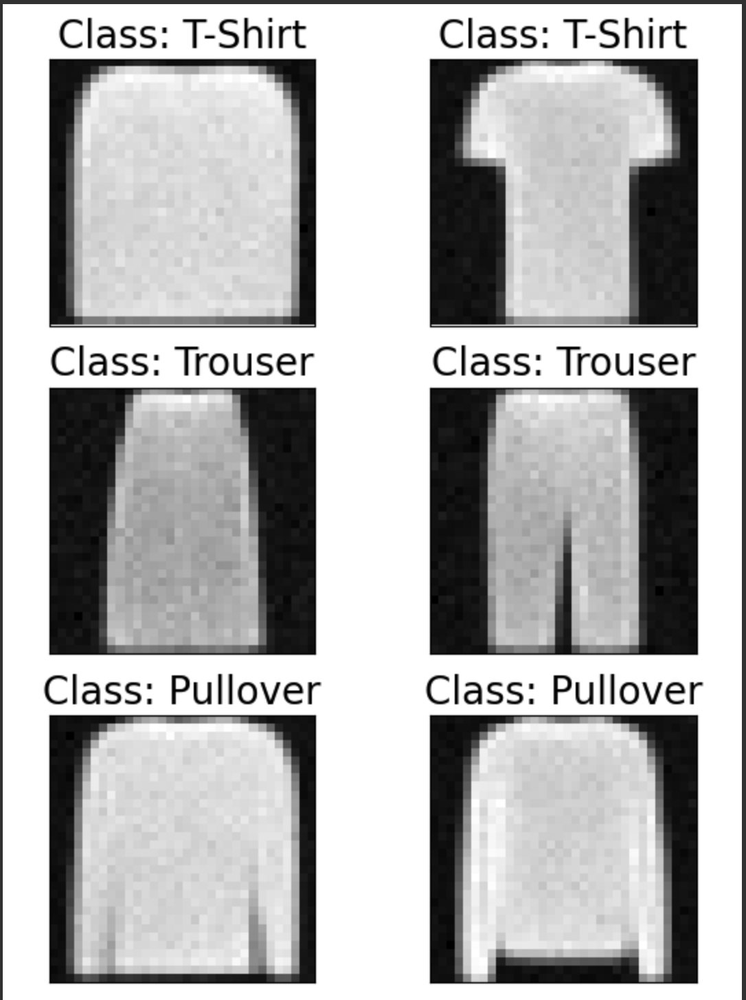
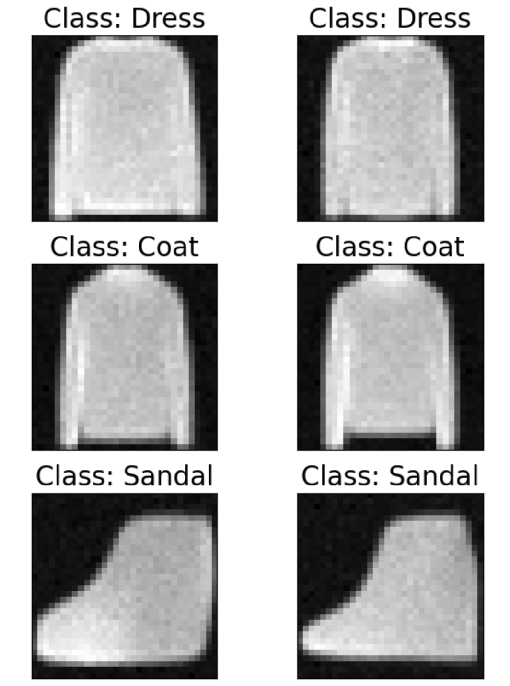
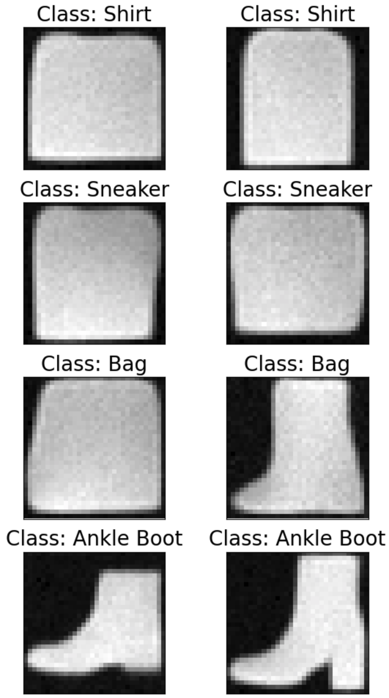

# FashionDiffusion
Implements a Diffusion Model for the Fashion MNIST Dataset

After training, this model is able to generate images that resemble the
Fashion MNIST dataset. You can specifically condition the model on the class
of the clothing item you wish to generate. Note that there at 10 different
classes: T-Shirts, Trousers, Pullovers, Dresses, Coats, Sandals, Shirts,
Sneakers, Bags, and Ankle Boots.

## How to run
Just type `jupyter notebook` into your terminal and open the link it gives you.
After that open the file `trainer.ipynb` and run the blocks. 

## Results
After training the model for 100 epochs on T4 GPUs through Google Colab,
we get the train loss of:

```
Epoch 35: train loss 0.0465
```

If we generate from the model at this point, we get:






The model is starting to learn some classes, but others are still poor.

To improve these results, we would need to scale up the hyperparameters and
train for longer. However, this requires more time and/or better GPUs, so we
leave it here for now.

# References
This toy project was heavily inspired by Damian Bogunowicz's video:
https://www.youtube.com/watch?v=S_il77Ttrmg&ab_channel=dtransposed

Also I'd like to cite:

Denoising Diffusion Probabilistic Models : https://arxiv.org/abs/2006.11239
Understanding Diffusion Models: A Unified Perspective: https://arxiv.org/abs/2208.11970
